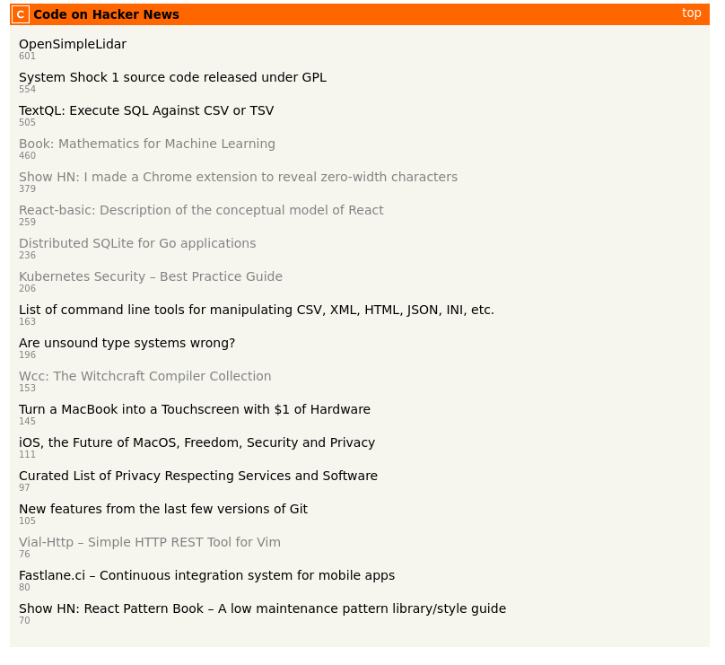

# Code HN

Hacker news with only links from GitHub or GitLab.



## Backend & Frontend Requirements

* [Protocol Buffer](https://github.com/google/protobuf) - Google's data interchange format

## Backend Requirements

* [golang](https://golang.org/) - The Go Programming Language
* [dep](https://github.com/golang/dep) - Go dependency management tool
* [xservice](https://github.com/donutloop/xservice) - Framework to generate web APIs

## Frontend Requirements

* [nodejs](https://nodejs.org/en/) - Node.js® is a JavaScript runtime 
* [npm](https://www.npmjs.com/) - npm is the package manager for JavaScrip
* [webpack](https://webpack.js.org/) - bundle your assets
* [vuejs](https://vuejs.org/) - The Progressive JavaScript Framework

## Backend Installation

### Generate Golang CHN service (Regenerate service)

```
protoc -I . ./chn.proto --xservice_out=./internal/handler --go_out=./internal/handler 
```

### Build Server 

```
go build cmd/chn/main.go
```

## Frontend Installation

### Generate Javascript CHN Client

```bash
 protoc -I . ./chn.proto  --js_out=import_style=commonjs,binary:./static/js --twirp_js_out=./static/js
```